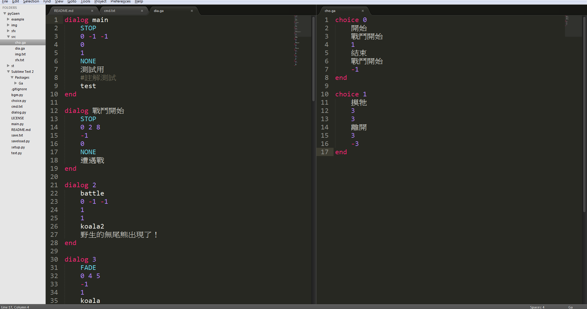
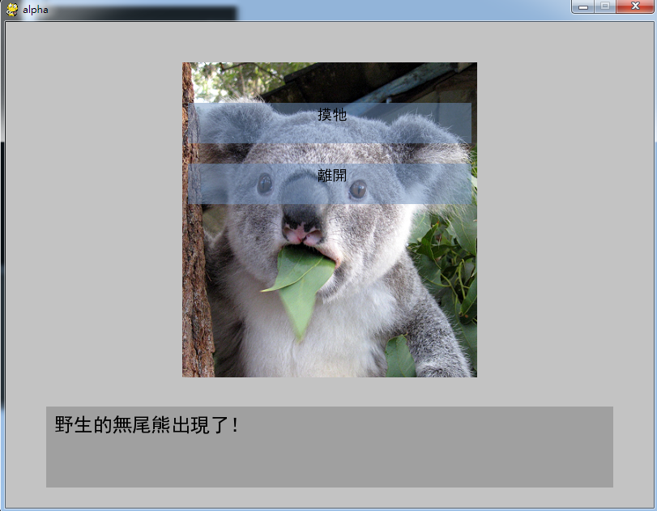

# pyGaen

##to use
###dia.txt
```
  dialog (name)
  <bgm>
  <branch point>if san bigger than or equal to point(dialog name | -1 = None, -2 = Exit)(dialog name)
  (choice name | -1 = None)
  (position)
  (img)
  <content>
  ...
  end
```

###cho.txt
```
  choice (name)
  <content>
  (dialog name)
  (weight)
  ...
  end
```
  
###img.txt
```
  img_name path
```

###sfx.txt
```
  sfx_name path
```

##Ga is for hilight .ga files
### experimental

##Example
###highlight
  
###run
  
